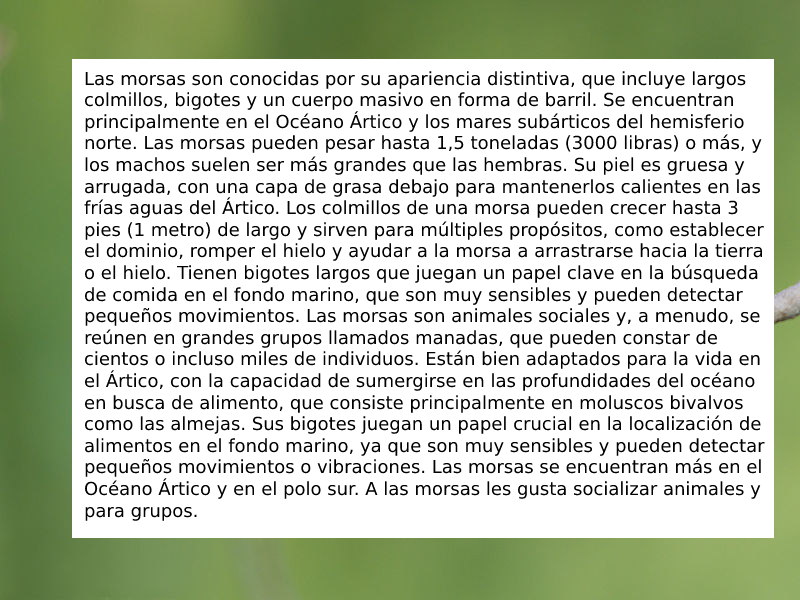
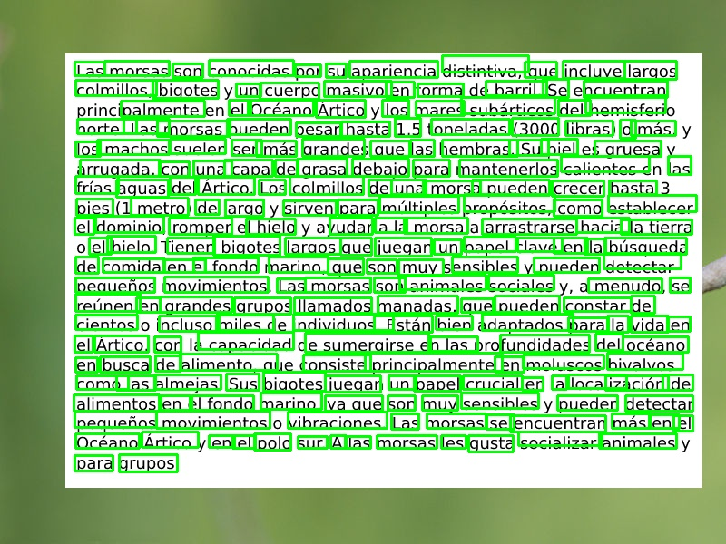

# This is the team project in the course STA 7722 by Dr. Alexander Mantzaris.

## Team 2: Jongjin Kim, Ifte Khairul Islam, Chandra Kundu, Ibrahim Almansour.

The first thing to do is as follows:

1. Clone the repository `git clone`
2. Make changes in the document.
3. Stage changes in the local repository. `git add .`
4. Commit changes with message to the local repository. `git commit -m "New Update"`
5. Push changes. `git push` 

## (Works to do)
+ Analyze the image to identify the text areas
- Find the area of interest with texts or draw a box for the area with texts
+ Extract the text as a string
- Map the image to a spanish dictionary - Use the prebuilt model.
+ Translate the text into Englilsh
- Build a translator between spanish to english.
+ Then summarize the text
+ Final output is the text and summary

(Important Date)
April 21st - Due date of the project

(Assignment)\
Chandra Kundu - Identify Text Areas \
Jongjin Kim - Extract Texts \
Ifte Khairul Islam - Text Translator \
Ibrahim Almansour - Text Summarizer 

(Challenges) \
Picture 1 - Works best because there is no distortion. \
Picture 2 - Works better in the bottom part than the top part. The top part has a distortion. \
Picture 3 - A lot of distortion makes it hard to apprehend. \
Picture 4 - Multiple areas detection is needed. Also, the windows of the building were detected as a rectangle area. 

# Image 

# Text Area Detection

# Text Extraction
[text1.txt](saved_texts/text1.txt)

# English Translation
[translated1.txt](translated_texts/text1.txt)

# Summary of the text
[summary1.txt](summarizedtext/text.1)